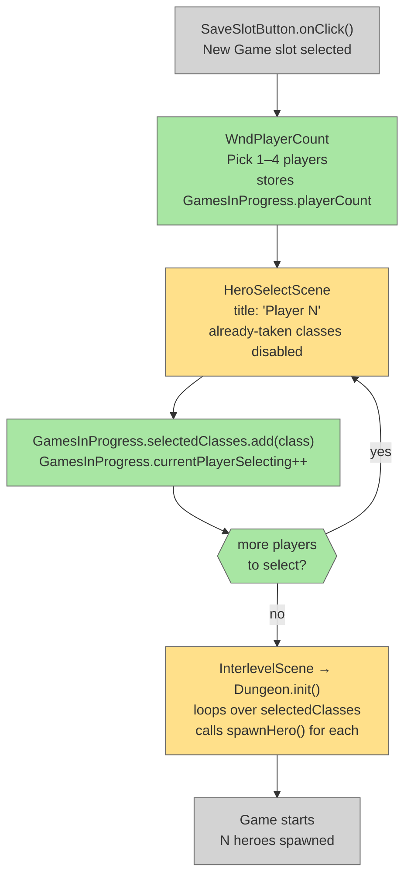

# Multiplayer Hero Selection UI

## System Intent

- What is being built: A UI flow that lets players choose 1–4 players before starting a new game, then select a hero class for each player in order. No two players may choose the same class. The existing single-player path is unchanged.
- Primary consumer(s): `StartScene`, `HeroSelectScene`, `Dungeon.init()`
- Boundary: New window `WndPlayerCount`; modifications to `HeroSelectScene`, `GamesInProgress`, and `Dungeon.init()`. No networking. No save-file schema changes.

## Stage Gate Tracker

- [ ] Stage 1 Mermaid approved
- [ ] Stage 2 Flows approved
- [ ] Stage 3 Logs + Deployment approved or skipped

## Mermaid Diagram



ONCE YOU GET APPROVAL FROM THE DEVELOPER, DELETE THIS LINE AND UPDATE THE STAGE GATE TRACKER

## Flows

### Global Types

```txt
StandardError {
  message: string
}

// New fields added to GamesInProgress (all static)
GamesInProgress.playerCount: int                    -- 1..4, set by WndPlayerCount
GamesInProgress.selectedClasses: ArrayList<HeroClass> -- one entry per player, in order
GamesInProgress.currentPlayerSelecting: int         -- 0-based index of player currently on hero select
```

---

### Flow: `playerCountWindow`
- Test files: N/A
- Core files:
  - `core/src/main/java/com/shatteredpixel/shatteredpixeldungeon/windows/WndPlayerCount.java` ← new file
  - `core/src/main/java/com/shatteredpixel/shatteredpixeldungeon/scenes/StartScene.java`

#### Types

```txt
WndPlayerCount extends Window
  // Four buttons: "1 Player", "2 Players", "3 Players", "4 Players"
  // On click: sets GamesInProgress.playerCount and playerCount, opens HeroSelectScene
```

#### Paths

| path | input | output | path-type | notes | updated |
| --- | --- | --- | --- | --- | --- |
| `playerCountWindow.show` | new-game slot selected in StartScene | `WndPlayerCount` shown | happy path | Replaces direct switch to HeroSelectScene in `SaveSlotButton.onClick()` | |
| `playerCountWindow.selectCount` | player taps 1–4 | `GamesInProgress.playerCount` set, `selectedClasses` cleared, `currentPlayerSelecting = 0`, switch to HeroSelectScene | happy path | | |
| `playerCountWindow.titleScene` | no existing saves (TitleScene direct path) | same WndPlayerCount shown | happy path | TitleScene also routes through WndPlayerCount before HeroSelectScene | |

#### Pseudocode

```
// StartScene.java — SaveSlotButton.onClick() new-game branch
// BEFORE: ShatteredPixelDungeon.switchScene(HeroSelectScene.class)
// AFTER:
GamesInProgress.curSlot = slot;
GamesInProgress.selectedClass = null;
scene.addToFront(new WndPlayerCount());

// WndPlayerCount.java
for count in [1, 2, 3, 4]:
    add button("count + " Player(s)") {
        GamesInProgress.playerCount = count;
        GamesInProgress.selectedClasses = new ArrayList<>();
        GamesInProgress.currentPlayerSelecting = 0;
        hide();
        ShatteredPixelDungeon.switchScene(HeroSelectScene.class);
    }
```

---

### Flow: `perPlayerHeroSelection`
- Test files: N/A
- Core files:
  - `core/src/main/java/com/shatteredpixel/shatteredpixeldungeon/scenes/HeroSelectScene.java`

#### Types

```txt
// HeroSelectScene reads GamesInProgress.currentPlayerSelecting to:
// 1. Set subtitle label: "Player N" (1-based)
// 2. Disable HeroBtn for any class already in GamesInProgress.selectedClasses
// Start button onClick() stores class and advances player or starts game
```

#### Paths

| path | input | output | path-type | notes | updated |
| --- | --- | --- | --- | --- | --- |
| `perPlayerHeroSelection.subtitle` | `currentPlayerSelecting >= 1` (multiplayer) | subtitle label shows "Player N" | happy path | single-player (playerCount==1) shows existing subtitle text | |
| `perPlayerHeroSelection.disableTaken` | hero class already in `selectedClasses` | that HeroBtn is visually disabled and unclickable | happy path | prevents two players choosing the same class | |
| `perPlayerHeroSelection.advancePlayer` | Start clicked, more players remain | class added to `selectedClasses`, `currentPlayerSelecting++`, switch to HeroSelectScene | happy path | loop back for next player | |
| `perPlayerHeroSelection.lastPlayer` | Start clicked, all players selected | class added to `selectedClasses`, proceed to InterlevelScene | happy path | same as existing single-player start flow | |
| `perPlayerHeroSelection.singlePlayer` | `playerCount == 1` | existing flow unchanged; `selectedClasses` gets one entry | happy path | backwards compat | |

#### Pseudocode

```
// HeroSelectScene.create() — add subtitle for multiplayer
if (GamesInProgress.playerCount > 1):
    subtitle.text("Player " + (GamesInProgress.currentPlayerSelecting + 1))

// HeroSelectScene.create() — disable already-taken classes
for HeroBtn btn : heroButtons:
    if GamesInProgress.selectedClasses.contains(btn.heroClass):
        btn.enable(false)

// HeroSelectScene.startBtn.onClick() — replace direct InterlevelScene switch
GamesInProgress.selectedClasses.add(GamesInProgress.selectedClass);
GamesInProgress.currentPlayerSelecting++;

if (GamesInProgress.currentPlayerSelecting < GamesInProgress.playerCount):
    // more players to select — loop back
    GamesInProgress.selectedClass = null;
    ShatteredPixelDungeon.switchScene(HeroSelectScene.class);
else:
    // all players selected — start game (existing logic)
    Dungeon.hero = null;
    Dungeon.daily = false;
    Dungeon.initSeed();
    ActionIndicator.clearAction();
    InterlevelScene.mode = Mode.DESCEND;
    Game.switchScene(InterlevelScene.class);
```

---

### Flow: `dungeonInitMultiHero`
- Test files: N/A
- Core files:
  - `core/src/main/java/com/shatteredpixel/shatteredpixeldungeon/Dungeon.java`

#### Types

```txt
// Replace TEMP hardcoded second hero with loop over GamesInProgress.selectedClasses
// GamesInProgress.selectedClasses is populated by perPlayerHeroSelection flow
```

#### Paths

| path | input | output | path-type | notes | updated |
| --- | --- | --- | --- | --- | --- |
| `dungeonInitMultiHero.singlePlayer` | `selectedClasses` has 1 entry | one hero spawned, identical to current single-player behaviour | happy path | | |
| `dungeonInitMultiHero.multiPlayer` | `selectedClasses` has 2–4 entries | one hero spawned per entry in order | happy path | player 0 gets highest actPriority (acts first) | |
| `dungeonInitMultiHero.fallback` | `selectedClasses` null or empty | fall back to `selectedClass` singleton | backwards compat | safety net for old code paths | |

#### Pseudocode

```
// Dungeon.java — Dungeon.init() — REPLACE TEMP block:
// REMOVE:
//   HeroClass secondClass = ...
//   spawnHero(secondClass);

// REPLACE WITH:
if (GamesInProgress.selectedClasses != null && !GamesInProgress.selectedClasses.isEmpty()):
    for HeroClass cls : GamesInProgress.selectedClasses:
        spawnHero(cls);
else:
    // fallback: single-player using legacy selectedClass
    spawnHero(GamesInProgress.selectedClass);
```

ONCE YOU GET APPROVAL FROM THE DEVELOPER, DELETE THIS LINE AND UPDATE THE STAGE GATE TRACKER

## Logs

| Source | Location |
|--------|----------|
| In-game log | `GLog` — no new entries needed |
| Crash reporting | `ShatteredPixelDungeon.reportException()` — existing |

## Deployment

- Mechanism: `local only`
- Deploy command:
  ```bash
  ./gradlew desktop:debug
  ```
- Notes: Single-player games remain fully backwards compatible. Old saves load normally (heroes array falls back to `selectedClass`).

ONCE YOU GET APPROVAL FROM THE DEVELOPER, DELETE THIS LINE AND UPDATE THE STAGE GATE TRACKER
