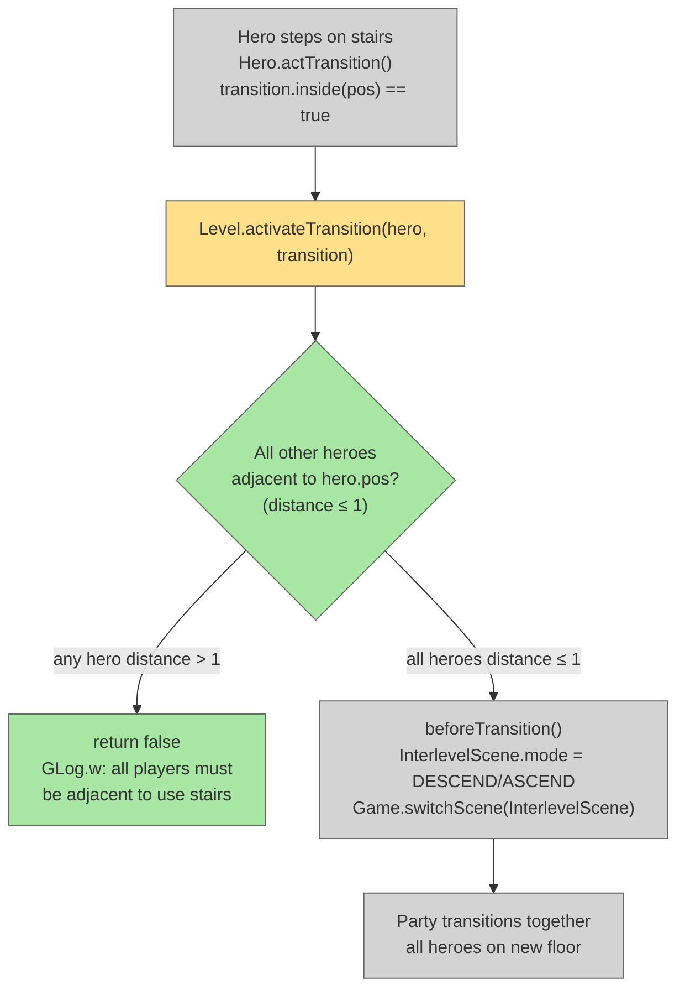

# Party Stair Gate

## System Intent

- What is being built: A gate on stair/level transitions that requires all heroes to be adjacent to the hero attempting to use the stairs. If any hero is not adjacent, the transition is blocked and a warning message is shown. Only when all heroes are within 1 tile of the stair hero does the party descend/ascend together.
- Primary consumer(s): `Level.activateTransition()`, `GLog`
- Boundary: One guard added to `Level.activateTransition()`. No changes to InterlevelScene, Hero.actTransition(), movement system, or save/load. Single-player (heroes.size() == 1) is completely unaffected.

## Stage Gate Tracker

- [x] Stage 1 Mermaid approved
- [x] Stage 2 Flows approved
- [x] Stage 3 Logs + Deployment approved or skipped

## Mermaid Diagram



## Flows

### Global Types

```txt
StandardError {
  message: string
}
```

---

### Flow: `partyStairGate`
- Test files: N/A
- Core files:
  - `core/src/main/java/com/shatteredpixel/shatteredpixeldungeon/levels/Level.java`
  - `core/src/main/assets/messages/levels/levels.properties`

#### Types

```txt
// Level.activateTransition() modified to check party proximity before allowing transition
// Distance check uses existing Level.distance(a, b) — Chebyshev distance (≤ 1 = adjacent or same cell)
```

#### Paths

| path | input | output | path-type | notes | updated |
| --- | --- | --- | --- | --- | --- |
| `partyStairGate.singlePlayer` | heroes.size() == 1 | transition proceeds normally, no check | happy path | Gate is a no-op for single-player | |
| `partyStairGate.allAdjacent` | all heroes within distance 1 of stair hero | transition proceeds normally | happy path | Party moves together | |
| `partyStairGate.heroNotAdjacent` | any hero distance > 1 from stair hero | transition blocked, GLog.w warning shown | blocked path | Hero must keep moving; stair hero must wait or re-attempt | |

#### Pseudocode

```
// Level.java — activateTransition() — ADD CHECK before beforeTransition():
// BEFORE: if (locked) return false;

// ADD AFTER locked check:
if (Dungeon.heroes != null && Dungeon.heroes.size() > 1) {
    for (Hero other : Dungeon.heroes) {
        if (other == hero) continue;
        if (distance(hero.pos, other.pos) > 1) {
            GLog.w(Messages.get(Level.class, "need_party_adjacent"));
            return false;
        }
    }
}

// levels.properties — add new key:
levels.level.need_party_adjacent=All players must be adjacent to use the stairs!
```

## Logs

| Source | Location |
|--------|----------|
| In-game log | `GLog.w` — "All players must be adjacent to use the stairs!" shown when transition blocked |

## Deployment

- Mechanism: `local only`
- Deploy command:
  ```bash
  ./gradlew desktop:debug
  ```
- Notes: Single-player is completely unaffected — the guard only runs when `heroes.size() > 1`. Works for all transition types (descend, ascend, branch entrances/exits).


