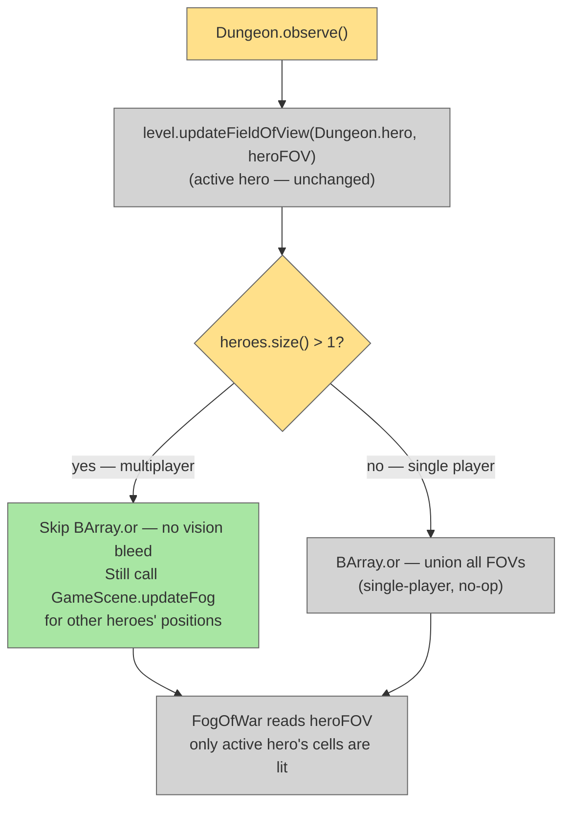

# Per-Player Visibility (Pass-and-Play)

## System Intent

- **What is being built:** In pass-and-play multiplayer, only the active hero's field of view is visible. Currently `Dungeon.observe()` unions all heroes' FOVs into one shared bitmap — this plan removes that union for multiplayer so only `Dungeon.hero` (the active hero, set by `Hero.activate()` → `Dungeon.hero = this` at the start of each hero's turn) contributes to `level.heroFOV`. Single-player is unaffected. LAN is out of scope.
- **Primary consumers:** `Dungeon.observe()`
- **Boundary:** One conditional in `Dungeon.observe()`. No new classes, no changes to `Hero`, `Level`, `FogOfWar`, `GameScene`, or save format.

## Stage Gate Tracker

- [x] Stage 1 Mermaid approved
- [x] Stage 2 Flows approved
- [x] Stage 3 Logs + Deployment approved or skipped

## Mermaid Diagram



## Flows

### Global Types

```txt
// No new types. Dungeon.hero is already the active hero via Hero.activate().
// heroes.size() > 1 is the multiplayer gate.
```

---

### Flow: `restrictFovToActiveHero`
- Test files: N/A
- Core files:
  - `core/src/main/java/com/shatteredpixel/shatteredpixeldungeon/Dungeon.java`

#### Paths

| path | input | output | path-type | notes | updated |
| --- | --- | --- | --- | --- | --- |
| `fov.singlePlayer` | `heroes.size() == 1` | existing union loop (no-op — only one hero) | happy path | No change | |
| `fov.multiplayerActiveHero` | `heroes.size() > 1` | heroFOV = only Dungeon.hero's vision; fog updates at other heroes' positions | happy path | Core change | |

#### Pseudocode

```
// Dungeon.observe() — current code:
level.updateFieldOfView(hero, level.heroFOV);
if (heroes != null) {
    boolean[] tmpFOV = new boolean[level.heroFOV.length];
    for (Hero h : heroes) {
        if (h == hero) continue;
        level.updateFieldOfView(h, tmpFOV);
        BArray.or(level.heroFOV, tmpFOV, level.heroFOV);   // ← skip this in multiplayer
        GameScene.updateFog(h.pos, h.viewDistance + 1);
    }
}

// CHANGE TO:
level.updateFieldOfView(hero, level.heroFOV);
if (heroes != null) {
    if (heroes.size() > 1) {
        // Pass-and-play: active hero's FOV only — no union.
        // Still refresh fog rendering at other heroes' positions.
        for (Hero h : heroes) {
            if (h == hero) continue;
            GameScene.updateFog(h.pos, h.viewDistance + 1);
        }
    } else {
        // Single player — existing union loop (effectively no-op since only one hero)
        boolean[] tmpFOV = new boolean[level.heroFOV.length];
        for (Hero h : heroes) {
            if (h == hero) continue;
            level.updateFieldOfView(h, tmpFOV);
            BArray.or(level.heroFOV, tmpFOV, level.heroFOV);
            GameScene.updateFog(h.pos, h.viewDistance + 1);
        }
    }
}
```

## Logs

| Source | Location |
|--------|----------|
| — | No new log output |

## Deployment

- Mechanism: `local only`
- Deploy command:
  ```bash
  ./gradlew desktop:debug
  ```
- Notes: Single-player completely unaffected. `Dungeon.hero` is already rotated to the active hero by `Hero.activate()` at the start of each turn, so no structural changes are needed for the hero-switching mechanism.
