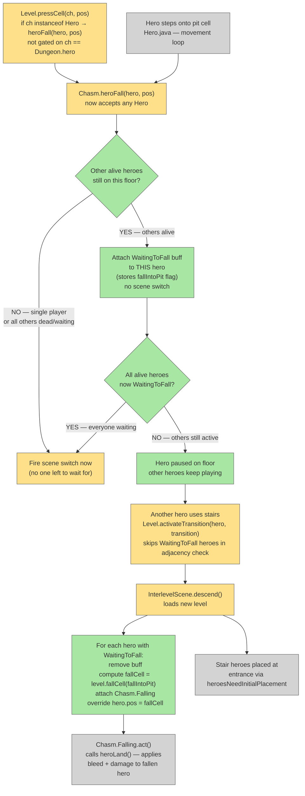

# Pit-Fall Party Sync

## System Intent

- **What is being built:** When any hero falls into a chasm/pit in multiplayer, they enter a `WaitingToFall` state instead of immediately triggering a scene switch. The floor transition fires only when ALL alive heroes are either `WaitingToFall` (fell into a pit) or actively descending stairs. On the new floor, falling heroes land at the fall cell and take `Chasm.Falling` damage; stair heroes land at the entrance. The logic is fully hero-agnostic — it works regardless of which of the 4 heroes fell, which used stairs, and which are dead.
- **Primary consumers:** `Chasm.heroFall()`, `Level.pressCell()`, `Level.activateTransition()`, `InterlevelScene.descend()`
- **Boundary:** Changes are limited to `Chasm.java`, `Level.java`, `Hero.java`, and `InterlevelScene.java`. No changes to save format, `Dungeon.switchLevel()`, the actor turn system, or single-player behavior.

## Stage Gate Tracker

- [x] Stage 1 Mermaid approved
- [x] Stage 2 Flows approved
- [x] Stage 3 Logs + Deployment approved or skipped

## Mermaid Diagram



## Flows

### Global Types

```txt
Hero {
  pos: int
  depth: int
  isAlive(): boolean
  buff(Class): Buff | null
}

WaitingToFall extends Buff {
  fallIntoPit: boolean   // true if the pit was a WeakFloorRoom (determines landing cell)
}
```

---

### Flow: `heroFallWaiting`
- Test files: N/A
- Core files:
  - `core/src/main/java/com/shatteredpixel/shatteredpixeldungeon/levels/features/Chasm.java`
  - `core/src/main/java/com/shatteredpixel/shatteredpixeldungeon/levels/Level.java`
  - `core/src/main/java/com/shatteredpixel/shatteredpixeldungeon/actors/hero/Hero.java`

#### Types

```txt
// WaitingToFall buff — attached to a hero who fell while others are still on this floor
WaitingToFall {
  fallIntoPit: boolean
  act(): spend(TICK); return true   // just stays alive, transition handled externally
  storeInBundle / restoreFromBundle — persists fallIntoPit
}
```

#### Paths

| path | input | output | path-type | notes | updated |
| --- | --- | --- | --- | --- | --- |
| `heroFallWaiting.multiplayerOtherAlive` | hero steps into pit; ≥1 other alive hero on floor | WaitingToFall buff attached; no scene switch | happy path | Hero is paused; others keep playing | |
| `heroFallWaiting.lastOneOrSinglePlayer` | hero steps into pit; all others dead or already WaitingToFall | immediate scene switch (existing path) | happy path | No one left to wait for | |
| `heroFallWaiting.heroAlreadyDead` | hero falls but is dead | hero.sprite.visible = false | edge | No change from current behavior | |

#### Pseudocode

```
// Chasm.java — heroFall(Hero hero, int pos)
// CHANGE: signature takes 'hero' parameter instead of using Dungeon.hero

heroFall(Hero hero, int pos):
  jumpConfirmed = false
  Sample.play(FALLING)

  if !hero.isAlive():
    hero.sprite.visible = false
    return

  hero.interrupt()

  if Dungeon.heroes != null && Dungeon.heroes.size() > 1:
    boolean fallIntoPit = level instanceof RegularLevel
                          && level.room(pos) instanceof WeakFloorRoom
    if fallIntoPit: Notes.remove(DISTANT_WELL)

    // Count alive heroes NOT yet waiting (excluding this one)
    for h in Dungeon.heroes:
      if h == hero: continue
      if !h.isAlive(): continue
      if h.buff(WaitingToFall.class) != null: continue
      // Found a live active hero — park this hero and return
      WaitingToFall w = Buff.affect(hero, WaitingToFall.class)
      w.fallIntoPit = fallIntoPit
      return   // NO scene switch

  // No one to wait for — fall immediately (existing path)
  Level.beforeTransition()
  InterlevelScene.mode = FALL
  InterlevelScene.fallIntoPit = (level instanceof RegularLevel
                                 && level.room(pos) instanceof WeakFloorRoom)
  if InterlevelScene.fallIntoPit: Notes.remove(DISTANT_WELL)
  Game.switchScene(InterlevelScene.class)


// Level.java — pressCell() — fix pit detection to cover ALL heroes, not just Dungeon.hero
// Line ~1185: change  "if (ch == Dungeon.hero)"  to  "if (ch instanceof Hero)"
if (pit[ch.pos]):
  if (ch instanceof Hero):
    Chasm.heroFall((Hero)ch, ch.pos)   // pass the actual hero
  else if (ch instanceof Mob):
    Chasm.mobFall((Mob)ch)
  return


// Hero.java — heroFall call site (~line 1881)
// CHANGE: pass 'this' as the hero
Chasm.heroFall(this, step)    // was: Chasm.heroFall(target)
// NOTE: use 'step' (the pit cell being moved to), not 'target'
```

---

### Flow: `partyDescendsWithWaiting`
- Test files: N/A
- Core files:
  - `core/src/main/java/com/shatteredpixel/shatteredpixeldungeon/levels/Level.java`
  - `core/src/main/java/com/shatteredpixel/shatteredpixeldungeon/scenes/InterlevelScene.java`

#### Types

```txt
// No new types — uses WaitingToFall buff and existing Chasm.Falling buff
```

#### Paths

| path | input | output | path-type | notes | updated |
| --- | --- | --- | --- | --- | --- |
| `partyDescends.stairsWithWaiting` | any hero uses stairs; party stair gate passes for non-WaitingToFall heroes; ≥1 other hero has WaitingToFall | DESCEND fires; WaitingToFall heroes placed at fall cells with Chasm.Falling | happy path | Core sync flow — any number of active heroes can still descend together | |
| `partyDescends.adjacencySkipsWaiting` | hero on stairs; some heroes WaitingToFall, others active and adjacent | WaitingToFall heroes excluded from adjacency check; only active heroes must be adjacent | happy path | WaitingToFall heroes never block the party stair gate | |
| `partyDescends.activeNotAdjacent` | hero on stairs; another active (non-WaitingToFall) hero is not adjacent | transition blocked by existing party stair gate; WaitingToFall heroes ignored | blocked path | Existing gate behavior; falling hero still waits | |
| `partyDescends.noWaiting` | hero uses stairs; no WaitingToFall heroes | normal descent, no change | happy path | Existing behavior unaffected | |

#### Pseudocode

```
// Level.java — activateTransition() — skip WaitingToFall heroes in adjacency check
// ADD alongside the existing Falling buff skip:
if (other.buff(Chasm.WaitingToFall.class) != null) continue


// InterlevelScene.java — descend() — after loading new level, before switchLevel
// ADD after: "LevelTransition destTransition = level.getTransition(curTransition.destType);"

// Collect fall placements for any WaitingToFall heroes
HashMap<Hero, Integer> fallPlacements = new HashMap<>()
for (Hero h : Dungeon.heroes):
  WaitingToFall w = h.buff(WaitingToFall.class)
  if w != null:
    fallPlacements.put(h, level.fallCell(w.fallIntoPit))
    w.detach()
    Buff.affect(h, Chasm.Falling.class)

// existing: heroesNeedInitialPlacement = true  (already there)
// existing: Dungeon.switchLevel(level, destTransition.cell())

// AFTER switchLevel — override positions for falling heroes
for (Map.Entry<Hero, Integer> e : fallPlacements.entrySet()):
  e.getKey().pos = e.getValue()
  e.getKey().depth = Dungeon.depth
```

---

### Flow: `allHerosFallingTogether`
- Test files: N/A
- Core files:
  - `core/src/main/java/com/shatteredpixel/shatteredpixeldungeon/levels/features/Chasm.java`

#### Paths

| path | input | output | path-type | notes | updated |
| --- | --- | --- | --- | --- | --- |
| `allFalling.lastHeroFalls` | last alive hero (others all WaitingToFall) steps into pit | immediate FALL scene switch | happy path | No stairs involved; last fall triggers transition | |

#### Pseudocode

```
// Covered by heroFallWaiting.lastOneOrSinglePlayer path above.
// When heroFall(hero, pos) is called and the loop finds NO other alive
// non-waiting heroes, the method falls through to the immediate scene switch.
// The existing InterlevelScene.fall() runs normally and places Dungeon.hero
// at the fall cell. WaitingToFall heroes on the old level are handled
// by descend(); for FALL mode, only hero[0] is the "fallen" one at this point
// and others (if any) would need the same placement treatment.
//
// EXTEND InterlevelScene.fall() similarly to descend():
// After "Buff.affect(Dungeon.hero, Chasm.Falling.class)", iterate heroes and
// apply the same fallPlacements logic as in descend().
```

## Logs

| Source | Location |
|--------|----------|
| In-game log | `GLog.w` — "All players must be adjacent" warning fires only for active (non-dead, non-WaitingToFall) heroes that are too far from stairs. Heroes with `WaitingToFall` are skipped before the distance check — the warning never fires for them. |

## Deployment

- Mechanism: `local only`
- Deploy command:
  ```bash
  ./gradlew desktop:debug
  ```
- Notes: Single-player is completely unaffected — all new multiplayer guards are inside `Dungeon.heroes.size() > 1` checks. The `WaitingToFall` buff serializes `fallIntoPit` so a save/load mid-wait restores correctly.
