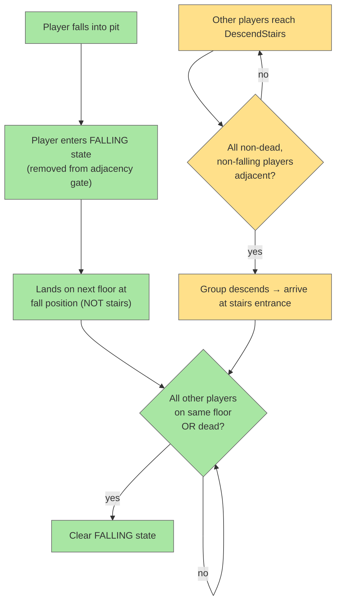

# Player Pit Falling (Multiplayer)

## System Intent

- What is being built: Correct multiplayer behavior for when a player falls down a
  pit/chasm to the next floor. A fallen player enters a **falling state** and the
  group's floor transitions stay synchronized so that all living players end up on
  the same floor.
- Primary consumer(s): Chasm/fall logic, `InterlevelScene` floor transitions,
  descend-stairs gating, `Dungeon.heroes[]` (multi-hero support — see
  `multi-hero-singleton-swap.md`).
- Boundary: No changes to single-player fall damage math or pit visuals. This is
  about *state* (falling) and *positioning* (land where you fell, not at the stairs)
  and *gating* (adjacency check ignores dead/falling players).

## Stage Gate Tracker

- [ ] Stage 1 Mermaid approved
- [ ] Stage 2 Flows approved
- [ ] Stage 3 Logs + Deployment approved or skipped

## Requirements

### 1. Falling state
When a player falls down a pit, that player enters a **falling state**. They remain
in the falling state until either of the following becomes true:

- All other (non-dead) players are on the next floor — i.e. the floor the fallen
  player landed on — **or**
- All other players are dead.

Restated: every non-dead player must either reach the same floor the fallen player
landed on, or be dead, before the fallen player leaves the falling state.

### 2. Landing position ("enter the floor the way you arrived")
- The fallen player must **not** appear at the stairs.
- The fallen player appears **wherever the fall took them** (the pit/chasm landing
  position).
- Generalize: every player arrives on the next floor at a position determined by
  **how they entered that floor**:
  - Descended via stairs → arrive at the stairs (descent entrance).
  - Fell through a pit → arrive at the fall/landing location.

### 3. Descend-stairs adjacency gating
The descend-stairs function currently requires all players to be adjacent before the
group goes down. This adjacency requirement applies **only** to players who are
**not dead and not falling**:

- Falling players are excluded from the adjacency check.
- Dead players are excluded from the adjacency check.

## Mermaid Diagram



## Flows (to be filled in during investigation)

> The following code areas are the expected touch points. Exact
> `file_path:line_number` references, types, paths, and pseudocode should be filled
> in after investigating the chasm/fall and interlevel-transition code, matching the
> table format used in `multi-hero-singleton-swap.md`.

### Flow: `enterFallingState`
- Core files (expected):
  - `core/src/main/java/com/shatteredpixel/shatteredpixeldungeon/levels/features/Chasm.java`
  - `core/src/main/java/com/shatteredpixel/shatteredpixeldungeon/actors/hero/Hero.java`
- Intent: mark a hero as falling when they go down a chasm; persist the flag
  through the level transition (and through save/load).

### Flow: `landAtFallPosition`
- Core files (expected):
  - `core/src/main/java/com/shatteredpixel/shatteredpixeldungeon/scenes/InterlevelScene.java`
  - `core/src/main/java/com/shatteredpixel/shatteredpixeldungeon/Dungeon.java`
  - `core/src/main/java/com/shatteredpixel/shatteredpixeldungeon/levels/Level.java`
- Intent: position each arriving hero based on how they entered (stairs entrance vs.
  fall landing tile). The fallen hero must not snap to the stairs.

### Flow: `clearFallingWhenGroupArrives`
- Core files (expected):
  - `core/src/main/java/com/shatteredpixel/shatteredpixeldungeon/Dungeon.java`
  - `core/src/main/java/com/shatteredpixel/shatteredpixeldungeon/actors/hero/Hero.java`
- Intent: when all other living heroes are on the fallen hero's floor (or dead),
  clear the falling state.

### Flow: `adjacencyIgnoresDeadAndFalling`
- Core files (expected):
  - descend-stairs / `InterlevelScene` adjacency gate (the existing
    "all players must be adjacent" check)
- Intent: the adjacency precondition iterates only over heroes that are neither dead
  nor falling.

## Acceptance Criteria

- [ ] A player who falls down a pit enters a falling state and stays in it until all
      other living players are on the new floor, or all other players are dead.
- [ ] A fallen player lands at the fall location on the next floor, not at the stairs.
- [ ] Players arriving on the next floor are positioned according to how they entered
      (stairs entrance vs. fall landing).
- [ ] The descend-stairs adjacency check ignores dead and falling players.
- [ ] After transitions resolve, all living players are on the same floor (or dead).

## Logs

| Source | Location |
|--------|----------|
| In-game log | `GLog` — existing |
| Crash reporting | `ShatteredPixelDungeon.reportException()` — existing |

## Deployment

- Mechanism: `local only`
- Deploy command:
  ```bash
  ./gradlew desktop:debug
  ```
- Notes: No server-side component. Falling state must survive save/load.
