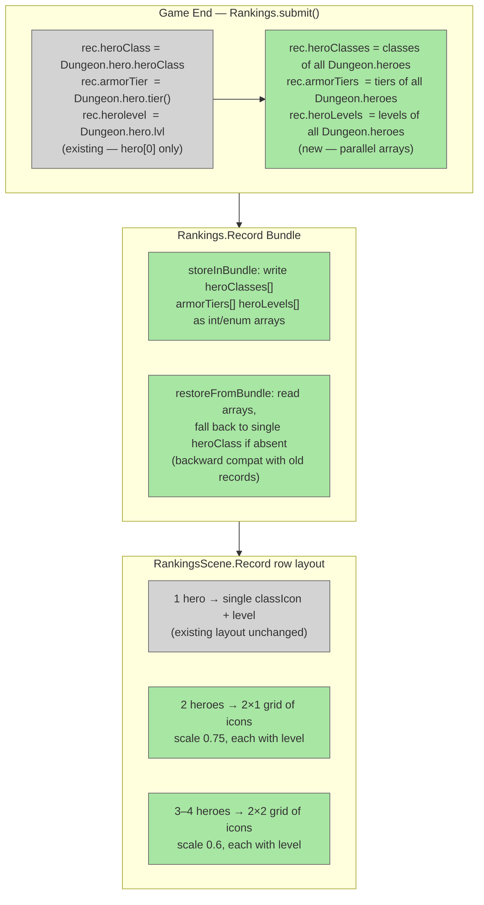

# Rankings Multi-Hero Icons

## System Intent

- What is being built: Update the rankings list rows to show a grid of hero class icons (and their levels) for all heroes in a multiplayer run, using the same 1×1 / 2×1 / 2×2 grid pattern already implemented on the save-slot screen. Single-player rows are unchanged.
- Primary consumer(s): `RankingsScene.Record`, `Rankings.Record`
- Boundary: Changes limited to `Rankings.java` (add heroClasses/armorTiers/heroLevels arrays to Record) and `RankingsScene.java` (update row layout to show icon grid). No changes to WndRanking detail window, scoring, or save format beyond adding new optional bundle keys.

## Stage Gate Tracker

- [x] Stage 1 Mermaid approved
- [x] Stage 2 Flows approved
- [x] Stage 3 Logs + Deployment approved or skipped

## Mermaid Diagram



## Flows

### Global Types

```txt
StandardError {
  message: string
}

// New fields on Rankings.Record (parallel arrays, size >= 1)
Rankings.Record.heroClasses: HeroClass[]   -- all hero classes in order
Rankings.Record.armorTiers:  int[]         -- armor tiers in order
Rankings.Record.heroLevels:  int[]         -- hero levels in order
```

---

### Flow: `rankingsRecordMultiHeroData`
- Test files: N/A
- Core files:
  - `core/src/main/java/com/shatteredpixel/shatteredpixeldungeon/Rankings.java`

#### Types

```txt
// Rankings.Record gains three array fields mirroring GamesInProgress.Info.
// All serialized as int arrays / enum-name string arrays for bundle compat.
```

#### Paths

| path | input | output | path-type | notes | updated |
| --- | --- | --- | --- | --- | --- |
| `rankingsRecordMultiHeroData.submit` | Game ends with N heroes | heroClasses/armorTiers/heroLevels populated from Dungeon.heroes | happy path | Fallback: if Dungeon.heroes empty, use single heroClass field | |
| `rankingsRecordMultiHeroData.store` | Record serialized to bundle | arrays written under new keys | happy path | Old single-hero keys (CLASS/TIER/LEVEL) kept for compat | |
| `rankingsRecordMultiHeroData.restore` | Record loaded from bundle | arrays read if keys present; fallback to single heroClass if absent | happy path | Old records load cleanly with heroClasses = [heroClass] | |

#### Pseudocode

```
// Rankings.java — Record class — add fields:
public HeroClass[] heroClasses;
public int[]       armorTiers;
public int[]       heroLevels;

// Rankings.submit() — AFTER existing single-hero assignment (line ~104):
if (Dungeon.heroes != null && !Dungeon.heroes.isEmpty()) {
    heroClasses = new HeroClass[Dungeon.heroes.size()];
    armorTiers  = new int[Dungeon.heroes.size()];
    heroLevels  = new int[Dungeon.heroes.size()];
    for (int i = 0; i < Dungeon.heroes.size(); i++) {
        heroClasses[i] = Dungeon.heroes.get(i).heroClass;
        armorTiers[i]  = Dungeon.heroes.get(i).tier();
        heroLevels[i]  = Dungeon.heroes.get(i).lvl;
    }
} else {
    heroClasses = new HeroClass[]{ rec.heroClass };
    armorTiers  = new int[]{ rec.armorTier };
    heroLevels  = new int[]{ rec.herolevel };
}

// Rankings.Record.storeInBundle() — ADD after existing CLASS/TIER/LEVEL:
// store hero class names as string array for bundle compat
String[] classNames = new String[heroClasses.length];
for (int i = 0; i < heroClasses.length; i++) classNames[i] = heroClasses[i].name();
bundle.put( "heroClasses", classNames );
bundle.put( "armorTiers",  armorTiers );
bundle.put( "heroLevels",  heroLevels );

// Rankings.Record.restoreFromBundle() — ADD after existing restore:
if (bundle.contains("heroClasses")) {
    String[] names = bundle.getStringArray("heroClasses");
    heroClasses = new HeroClass[names.length];
    for (int i = 0; i < names.length; i++) heroClasses[i] = HeroClass.valueOf(names[i]);
    armorTiers  = bundle.getIntArray("armorTiers");
    heroLevels  = bundle.getIntArray("heroLevels");
} else {
    heroClasses = new HeroClass[]{ heroClass };
    armorTiers  = new int[]{ armorTier };
    heroLevels  = new int[]{ herolevel };
}
```

---

### Flow: `rankingsRowIconGrid`
- Test files: N/A
- Core files:
  - `core/src/main/java/com/shatteredpixel/shatteredpixeldungeon/scenes/RankingsScene.java`

#### Types

```txt
// RankingsScene.Record replaces single classIcon + level with ArrayList<Image> + ArrayList<BitmapText>
// Layout mirrors the save-slot grid: same scale factors, same grid shape.
```

#### Paths

| path | input | output | path-type | notes | updated |
| --- | --- | --- | --- | --- | --- |
| `rankingsRowIconGrid.singleHero` | rec.heroClasses.length == 1 | single classIcon + level, existing position unchanged | happy path | No visual change for solo runs | |
| `rankingsRowIconGrid.twoHeroes` | length == 2 | 2×1 grid of icons (scale 0.75) at right edge, each with level | happy path | | |
| `rankingsRowIconGrid.threeOrFour` | length == 3 or 4 | 2×2 grid of icons (scale 0.6) at right edge, each with level | happy path | | |

#### Pseudocode

```
// RankingsScene.Record — replace:
//   private Image classIcon;   → private ArrayList<Image> classIcons = new ArrayList<>();
//   (no hero sprite in rankings rows — only class icon + level)

// createChildren(): create classIcons lazily in set() / update()

// In the constructor where rec is applied:
for (Image img : classIcons) remove(img);  classIcons.clear();
for (BitmapText t : levelTexts) remove(t); levelTexts.clear();

int n = rec.heroClasses.length;
float iconScale = n == 1 ? 1f : (n == 2 ? 0.75f : 0.6f);
for (int i = 0; i < n; i++) {
    Image icon = new Image(Icons.get(rec.heroClasses[i]));
    add(icon);
    classIcons.add(icon);

    BitmapText lvl = new BitmapText(PixelScene.pixelFont);
    if (rec.heroLevels != null && i < rec.heroLevels.length)
        lvl.text(Integer.toString(rec.heroLevels[i]));
    lvl.measure();
    add(lvl);
    levelTexts.add(lvl);
}

// layout() — right zone (was: classIcon at x+width-16, level centered on it):
int icols = n == 1 ? 1 : 2;
int irows = (n + icols - 1) / icols;
float iw = 16 * iconScale;
float ih = 16 * iconScale;
float izoneW = icols * iw + (icols - 1);
float izoneX = x + width - 4 - izoneW;
float izoneY = shield.y + (16 - irows * ih - (irows - 1)) / 2f;

for (int i = 0; i < classIcons.size(); i++) {
    Image icon = classIcons.get(i);
    icon.scale.set(iconScale);
    float ix = izoneX + (i % icols) * (iw + 1);
    float iy = izoneY + (i / icols) * (ih + 1);
    icon.x = ix;  icon.y = iy;
    align(icon);

    BitmapText lvl = levelTexts.get(i);
    lvl.x = ix + (iw - lvl.width()) / 2f;
    lvl.y = iy + (ih - lvl.height()) / 2f + 1;
    align(lvl);
}
// steps/depth icon moves left by izoneW to make room (was at x+width-32)
steps.x = izoneX - 18 + (16 - steps.width()) / 2f;
```

## Logs

| Source | Location |
|--------|----------|
| In-game log | `GLog` — no new entries needed |

## Deployment

- Mechanism: `local only`
- Deploy command:
  ```bash
  ./gradlew desktop:debug
  ```
- Notes: Old ranking records load cleanly — missing array keys fall back to the single `heroClass/armorTier/herolevel` fields. Single-player row layout is pixel-identical to before.


