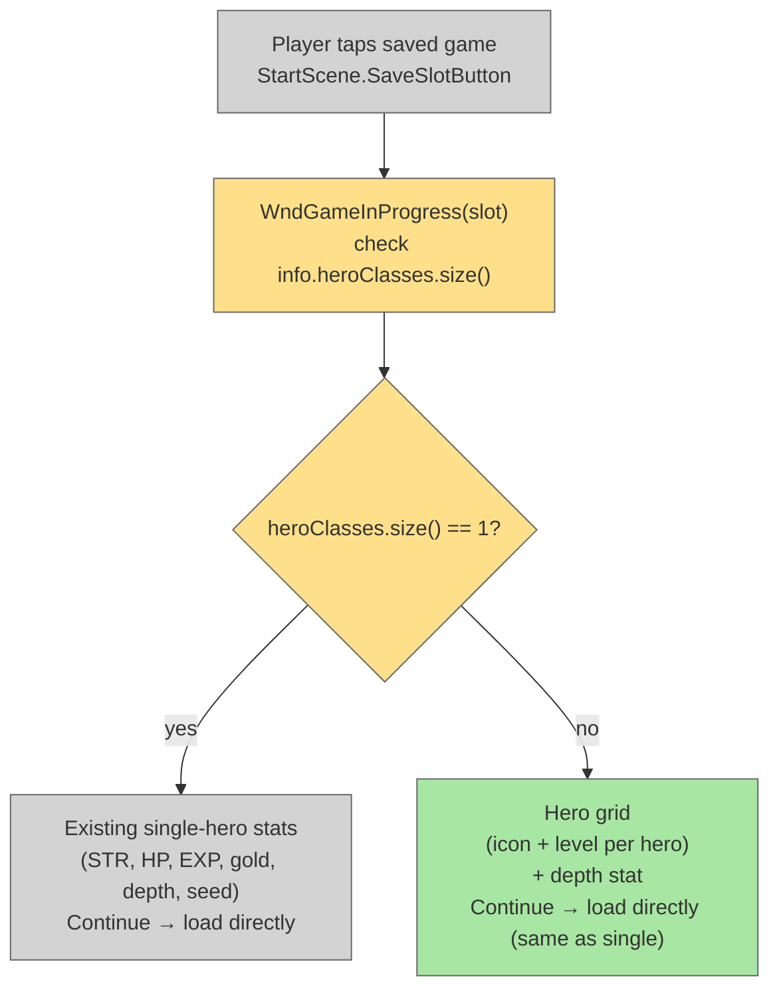

# Save Slot Multiplayer Preview

## System Intent

- **What is being built:** When a saved game has more than one hero (`info.heroClasses.size() > 1`), the save slot detail window (`WndGameInProgress`) shows a per-hero grid (class icon + level for each hero) instead of the single-hero stat block. The Continue button still loads the game normally — no LAN/routing changes. No new `isMultiplayerSave` flag is needed — multiplayer is already detectable via `info.heroClasses.size() > 1`.
- **Primary consumers:** `WndGameInProgress`
- **Boundary:** Changes limited to `WndGameInProgress.java` (conditional branch on hero count). No changes to `GamesInProgress`, `StartScene`, `InterlevelScene`, save format, or loading flow. Single-player saves are completely unaffected.

## Stage Gate Tracker

- [x] Stage 1 Mermaid approved
- [x] Stage 2 Flows approved
- [x] Stage 3 Logs + Deployment approved or skipped

## Mermaid Diagram



## Flows

### Global Types

```txt
GamesInProgress.Info {
  heroClasses: ArrayList<HeroClass>   // size > 1 → multiplayer (already exists)
  armorTiers:  ArrayList<Integer>     // already exists
  heroLevels:  ArrayList<Integer>     // already exists
}
```

---

### Flow: `multiplayerSavePreview`
- Test files: N/A
- Core files:
  - `core/src/main/java/com/shatteredpixel/shatteredpixeldungeon/windows/WndGameInProgress.java`

#### Paths

| path | input | output | path-type | notes | updated |
| --- | --- | --- | --- | --- | --- |
| `preview.singlePlayer` | `heroClasses.size() == 1` | existing single-hero stat block, Continue loads directly | happy path | No change to this path | |
| `preview.multiplayer` | `heroClasses.size() > 1` | hero grid (icon + level per hero) + depth stat; Continue loads game normally | happy path | | |

#### Pseudocode

```
// WndGameInProgress constructor — replace single stats block with branch:

boolean isMultiplayer = info.heroClasses.size() > 1;

if (isMultiplayer) {

    // Hero grid: one row per hero — avatar icon on left, "Lvl N  ClassName" on right
    for (int i = 0; i < info.heroClasses.size(); i++) {
        HeroClass cls = info.heroClasses.get(i);
        int tier      = info.armorTiers.get(i);
        int lvl       = info.heroLevels.get(i);
        // HeroSprite.avatar(cls, tier) + RenderedTextBlock "Lvl " + lvl + "  " + cls.title()
        // layout: advance pos by rowHeight + GAP each iteration
    }

    pos += GAP;

    // "Multiplayer" badge — small label or colored RenderedTextBlock
    RenderedTextBlock badge = PixelScene.renderTextBlock(
        Messages.get(this, "multiplayer_badge"), 6);
    badge.hardlight(0xFFD700); // gold tint
    badge.setPos((WIDTH - badge.width()) / 2f, pos);
    add(badge);
    pos = badge.bottom() + GAP;

    // Shared stats that apply to all saves
    statSlot(Messages.get(this, "depth"), info.maxDepth);
    // (skip STR/HP/EXP — those are per-hero, not useful in aggregate)

    pos += GAP;

    // Continue and Erase buttons unchanged — same load flow as single-player

} else {
    // existing single-player block unchanged (STR, HP, EXP, gold, depth, seed)
}
```

## Logs

| Source | Location |
|--------|----------|
| — | No new log output |

## Deployment

- Mechanism: `local only`
- Deploy command:
  ```bash
  ./gradlew desktop:debug
  ```
- Notes: Single-player saves completely unaffected — branch gated on `heroClasses.size() > 1`. No save format changes. No new dependencies.
