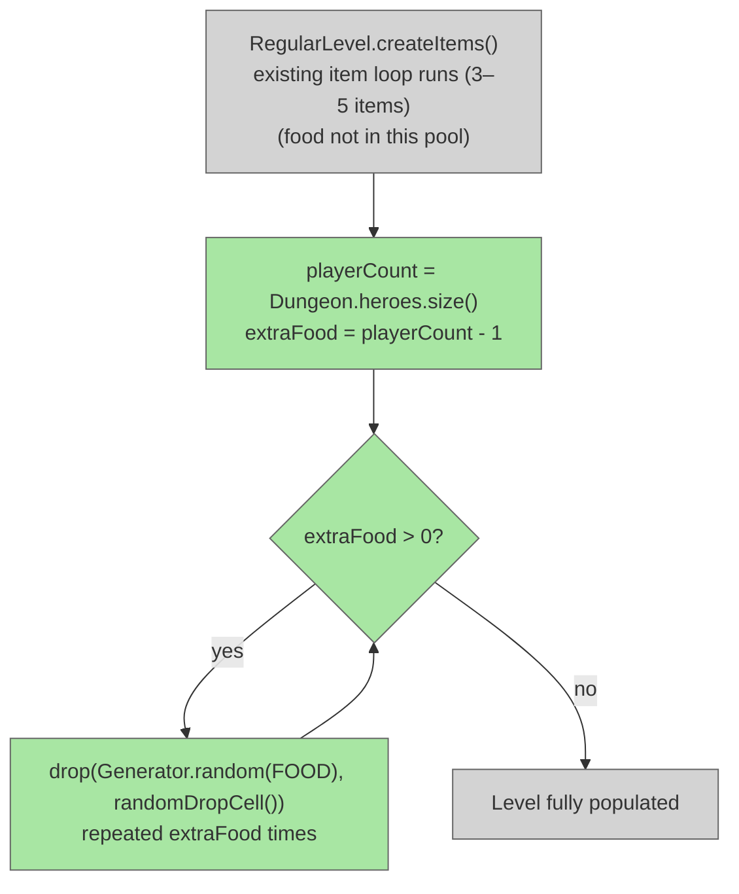

# Scale Food Spawns

## System Intent

- What is being built: Add one extra food item per additional player on each regular dungeon floor. A solo run is unchanged. A 2-player run gets +1 food per floor, 3-player gets +2, 4-player gets +3. Food is drawn from `Generator.Category.FOOD` (80% Food, 20% Pasty) and dropped at a random valid cell. Single-player and boss levels are unaffected.
- Primary consumer(s): `RegularLevel.createItems()`
- Boundary: One new loop at the end of `RegularLevel.createItems()`. No changes to `Generator`, `MobSpawner`, talent logic, or any other system. Food already in the level (from talents, Monk drops, etc.) is unaffected.

## Root Cause

Food has `firstProb=0, secondProb=0` in `Generator` — it never appears in the normal `Generator.random()` item pool. Food on floors comes from: the `CACHED_RATIONS` talent (SupplyRation in chests) and Monk mob drops (8.3% chance). Neither source scales with player count, so multiplayer parties share the same food supply as a solo run despite needing N× more.

## Stage Gate Tracker

- [x] Stage 1 Mermaid approved
- [x] Stage 2 Flows approved
- [x] Stage 3 Logs + Deployment approved or skipped

## Mermaid Diagram




## Flows

### Global Types

```txt
StandardError {
  message: string
}
```

---

### Flow: `scaleFloorFoodDrops`
- Test files: N/A
- Core files:
  - `core/src/main/java/com/shatteredpixel/shatteredpixeldungeon/levels/RegularLevel.java`

#### Types

```txt
// After existing createItems() loop, drop (heroes.size() - 1) food items
// using Generator.random(Generator.Category.FOOD) — 80% Food, 20% Pasty
```

#### Paths

| path | input | output | path-type | notes | updated |
| --- | --- | --- | --- | --- | --- |
| `scaleFloorFoodDrops.singlePlayer` | heroes.size() == 1 | extraFood = 0, no drops added | happy path | Identical to before | |
| `scaleFloorFoodDrops.twoPlayers` | heroes.size() == 2 | 1 extra food item dropped on floor | happy path | | |
| `scaleFloorFoodDrops.fourPlayers` | heroes.size() == 4 | 3 extra food items dropped on floor | happy path | | |
| `scaleFloorFoodDrops.nullHeroes` | Dungeon.heroes null or empty | extraFood = 0, no drops | happy path | Defensive fallback | |

#### Pseudocode

```
// RegularLevel.createItems() — ADD at end of method, before closing brace:

int playerCount = (Dungeon.heroes != null && !Dungeon.heroes.isEmpty())
        ? Dungeon.heroes.size()
        : 1;
for (int i = 0; i < playerCount - 1; i++) {
    int cell = randomDropCell();
    if (cell != -1) {
        drop(Generator.random(Generator.Category.FOOD), cell);
    }
}
```


## Logs

| Source | Location |
|--------|----------|
| In-game log | `GLog` — no new entries needed |

## Deployment

- Mechanism: `local only`
- Deploy command:
  ```bash
  ./gradlew desktop:debug
  ```
- Notes: Single-player unchanged (loop runs 0 times). Boss levels and special levels do not call `RegularLevel.createItems()` so they are unaffected. `randomDropCell()` returns -1 if no valid cell found — the null check prevents a crash in that edge case.

ONCE YOU GET APPROVAL FROM THE DEVELOPER, DELETE THIS LINE AND UPDATE THE STAGE GATE TRACKER
