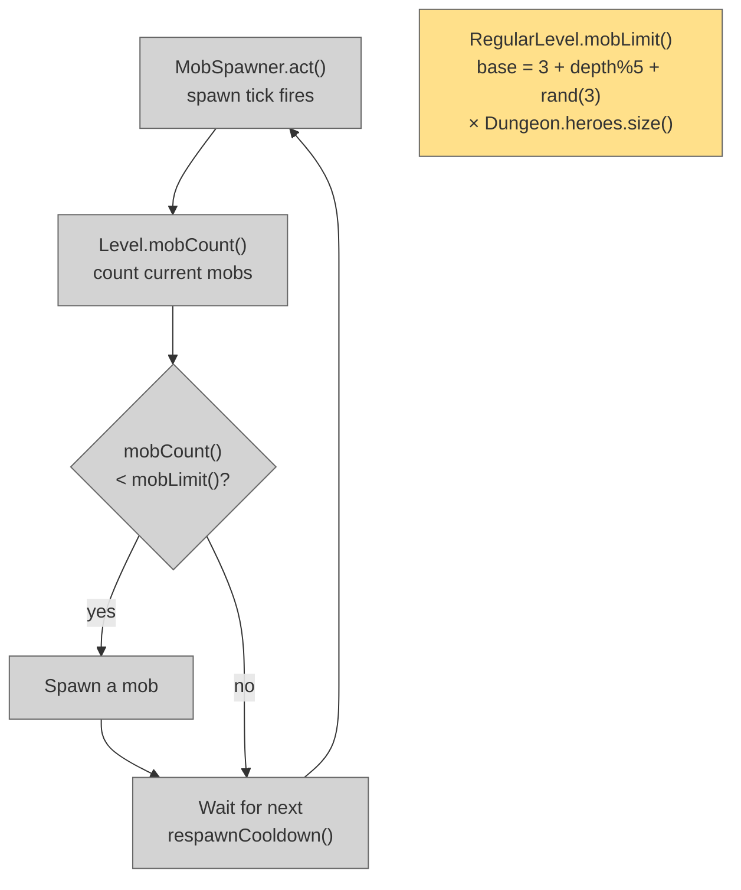

# Scale Monster Spawns

## System Intent

- What is being built: Scale the maximum number of monsters that can exist on a floor at once (`mobLimit()`) by the number of players. A solo run is identical to before. A 2-player run allows twice as many mobs, 3-player three times, etc. Spawn frequency (cooldown) is unchanged — the spawner naturally fills up to the higher cap at the same rate. Boss levels and special levels are unaffected.
- Primary consumer(s): `RegularLevel.mobLimit()`, `MiningLevel.mobLimit()`
- Boundary: One multiplication in `RegularLevel.mobLimit()`. No changes to `respawnCooldown()`, `MobSpawner`, boss level logic, or post-amulet spawn paths.

## Stage Gate Tracker

- [x] Stage 1 Mermaid approved
- [x] Stage 2 Flows approved
- [x] Stage 3 Logs + Deployment approved or skipped

## Mermaid Diagram




## Flows

### Global Types

```txt
StandardError {
  message: string
}
```

---

### Flow: `scaleRegularMobLimit`
- Test files: N/A
- Core files:
  - `core/src/main/java/com/shatteredpixel/shatteredpixeldungeon/levels/RegularLevel.java`
  - `core/src/main/java/com/shatteredpixel/shatteredpixeldungeon/levels/MiningLevel.java`

#### Types

```txt
// RegularLevel.mobLimit() returns base × Dungeon.heroes.size()
// heroes.size() is always >= 1, so single-player is unchanged
```

#### Paths

| path | input | output | path-type | notes | updated |
| --- | --- | --- | --- | --- | --- |
| `scaleRegularMobLimit.singlePlayer` | heroes.size() == 1 | existing limit unchanged (× 1) | happy path | pixel-identical to before | |
| `scaleRegularMobLimit.twoPlayers` | heroes.size() == 2 | limit × 2 | happy path | e.g. depth 5 base 5 → limit 10 | |
| `scaleRegularMobLimit.fourPlayers` | heroes.size() == 4 | limit × 4 | happy path | | |
| `scaleRegularMobLimit.depth1` | depth == 1, no amulet | returns 0 × N = 0 (no spawns on floor 1) | happy path | Floor 1 stays mob-free at start | |
| `scaleRegularMobLimit.depth1Amulet` | depth == 1, amulet obtained | returns 10 × N | happy path | Post-amulet floor 1 scales too | |
| `scaleRegularMobLimit.mining` | MiningLevel | super.mobLimit() × N − 1 (existing offset kept) | happy path | MiningLevel.mobLimit() calls super so scaling applies automatically | |

#### Pseudocode

```
// RegularLevel.java — mobLimit() — REPLACE return statement:
// BEFORE:
//   return mobs;

// AFTER:
int playerCount = (Dungeon.heroes != null && !Dungeon.heroes.isEmpty())
        ? Dungeon.heroes.size()
        : 1;
return mobs * playerCount;

// NOTE: The depth==1 early returns also need scaling:
// BEFORE (depth<=1, no amulet):   return 0;      → stays 0 (0 × N = 0, fine)
// BEFORE (depth<=1, amulet):      return 10;     → return 10 * playerCount;
// The main mobs calculation only runs when depth > 1, so only one line changes there.
```


## Logs

| Source | Location |
|--------|----------|
| In-game log | `GLog` — no new entries needed |

## Deployment

- Mechanism: `local only`
- Deploy command:
  ```bash
  ./gradlew desktop:debug
  ```
- Notes: Single-player (`heroes.size() == 1`) is pixel-identical to before. Boss levels use `Level.mobLimit()` base which returns 0, so they are unaffected. MiningLevel calls `super.mobLimit() - 1` so it inherits the scaling automatically.

ONCE YOU GET APPROVAL FROM THE DEVELOPER, DELETE THIS LINE AND UPDATE THE STAGE GATE TRACKER
