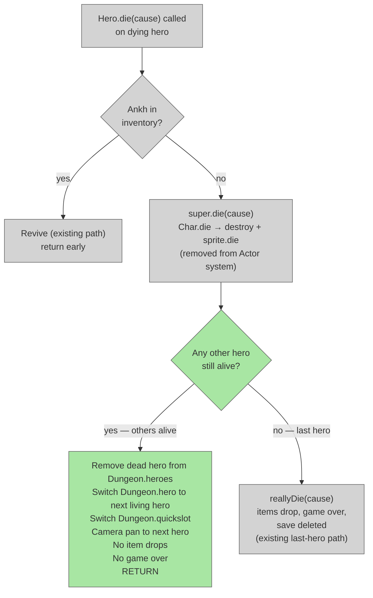

# Single Hero Death Handling

## System Intent

- What is being built: When a hero dies in multiplayer and other heroes are still alive, the dead hero is silently removed (no item drops, no game-over screen). The game only ends when the last living hero dies. Ankh resurrection still works normally. Single-player is completely unchanged.
- Primary consumer(s): `Hero.die()`, `Hero.reallyDie()`, `Char.java` (Dungeon.fail guard)
- Boundary: Guard added in `Hero.die()` before `reallyDie()` call. Guard added at `Char.java` line 580 for `Dungeon.fail()`. No changes to the Ankh path, rankings, save format, or GameScene.

## Stage Gate Tracker

- [x] Stage 1 Mermaid approved
- [x] Stage 2 Flows approved
- [x] Stage 3 Logs + Deployment approved or skipped

## Mermaid Diagram




## Flows

### Global Types

```txt
StandardError {
  message: string
}
```

---

### Flow: `singleHeroDeathGuard`
- Test files: N/A
- Core files:
  - `core/src/main/java/com/shatteredpixel/shatteredpixeldungeon/actors/hero/Hero.java`

#### Types

```txt
// Helper: count living heroes excluding this dying hero
int livingOthers = 0;
for (Hero h : Dungeon.heroes) {
    if (h != this && h.isAlive()) livingOthers++;
}
```

#### Paths

| path | input | output | path-type | notes | updated |
| --- | --- | --- | --- | --- | --- |
| `singleHeroDeathGuard.singlePlayer` | heroes.size() == 1 | reallyDie() called normally, game over | happy path | Unchanged from current behavior | |
| `singleHeroDeathGuard.nonLastHero` | other heroes alive | dead hero removed, Dungeon.hero switched, no item drop, no game over | happy path | Core new behavior | |
| `singleHeroDeathGuard.lastHero` | no other heroes alive | reallyDie() called normally, game over | happy path | Same as single-player path | |
| `singleHeroDeathGuard.ankhRevive` | Ankh in inventory | hero revived, returns early before guard | happy path | Ankh path unchanged, guard never reached | |

#### Pseudocode

```
// Hero.java — Hero.die() — between line 2223 (super.die) and line 2224 (reallyDie):
// INSERT after super.die(cause):

// Count living heroes other than this one
int livingOthers = 0;
if (Dungeon.heroes != null) {
    for (Hero h : Dungeon.heroes) {
        if (h != this && h.isAlive()) livingOthers++;
    }
}

if (livingOthers > 0) {
    // Other heroes alive — remove this hero silently, no game over
    Dungeon.heroes.remove(this);

    // Switch active hero to next living one
    Hero next = Dungeon.heroes.get(0); // first living hero (list now has others only)
    next.activate(); // sets Dungeon.hero, Dungeon.quickslot, pans camera
    return;
}

// Fall through to reallyDie() — this was the last hero
reallyDie(cause);
```

---

### Flow: `guardDungeonFail`
- Test files: N/A
- Core files:
  - `core/src/main/java/com/shatteredpixel/shatteredpixeldungeon/actors/Char.java`

#### Types

```txt
// At Char.java line 580, Dungeon.fail() is called when enemy == Dungeon.hero is killed.
// Guard it so rankings are only submitted when no other heroes survive.
```

#### Paths

| path | input | output | path-type | notes | updated |
| --- | --- | --- | --- | --- | --- |
| `guardDungeonFail.lastHero` | No other heroes alive | Dungeon.fail() called, ranking submitted | happy path | Unchanged from current | |
| `guardDungeonFail.notLastHero` | Other heroes alive | Dungeon.fail() skipped, game continues | happy path | Prevents premature ranking submission | |

#### Pseudocode

```
// Char.java — around line 580 — REPLACE:
// BEFORE:
//   Dungeon.fail( this );

// REPLACE WITH:
boolean lastHero = true;
if (Dungeon.heroes != null) {
    for (com.shatteredpixel.shatteredpixeldungeon.actors.hero.Hero h : Dungeon.heroes) {
        if (h != Dungeon.hero && h.isAlive()) { lastHero = false; break; }
    }
}
if (lastHero) Dungeon.fail( this );
```


## Logs

| Source | Location |
|--------|----------|
| In-game log | `GLog.n` — existing death kill message at Char.java:581 still fires, no change needed |

## Deployment

- Mechanism: `local only`
- Deploy command:
  ```bash
  ./gradlew desktop:debug
  ```
- Notes: Single-player is unchanged — with 1 hero, `livingOthers == 0` so `reallyDie()` always runs. Ankh path is unchanged — the guard is placed after the Ankh block in `Hero.die()`. Dead hero is removed from `Dungeon.heroes` so all subsequent multiplayer logic (stair gate, mob scaling, food scaling) uses the correct count.

ONCE YOU GET APPROVAL FROM THE DEVELOPER, DELETE THIS LINE AND UPDATE THE STAGE GATE TRACKER
